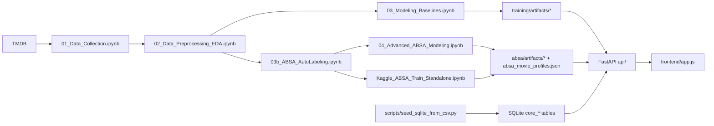

# CineSen Flow Audit

Tài liệu này chốt lại luồng hoạt động hiện tại của CineSen sau khi dọn runtime về `artifact-only` cho search, đồng thời ghi lại các file legacy/orphan để cleanup an toàn.

## 1. Runtime hiện tại

- Search runtime chính: `POST /recommendations/search` trong `api/routes/recommendations.py`
- Engine duy nhất cho web demo: artifact recommender trong `api/recommender.py`
- ABSA runtime: `POST /absa/analyze` trong `api/routes/absa.py`
- Nguồn artifact ABSA hiện tại: `Notebook_Report/Kaggle_ABSA_Train_Standalone.ipynb`, sau đó tải các file về `Notebook_Report/absa/`

## 2. End-to-end flow

## 3. Use case map

| Use case | User-facing flow | API / file chính | Input | Model / logic | Output |
| --- | --- | --- | --- | --- | --- |
| UC1. Catalog discovery | Trang chủ, phân trang phim | `frontend/app.js` -> `GET /movies` -> `api/routes/movies.py` | `page`, `page_size` | Không gọi model; đọc `core_movies`, `core_reviews`, `core_genres` từ SQLite | Danh sách phim, genre, rating trung bình, số review |
| UC2. Movie detail | Trang chi tiết phim | `frontend/app.js` -> `GET /movies/{id}` -> `api/routes/movies.py` | `movie_id` | Không gọi model; load metadata + full reviews từ SQLite | Chi tiết phim + danh sách review |
| UC3. Similar movies | Box `Similar Movies` ở trang chi tiết | `frontend/app.js` -> `GET /movies/{id}/similar` -> `api/routes/recommendations.py` | `movie_id`, `limit` | Đọc `similar_by_movie.json` và `movie_index.json` trong artifact notebook 03 | Danh sách phim tương tự, score precompute |
| UC4. Search theo vibe | Hero search / recommendations page | `frontend/app.js` -> `POST /recommendations/search` -> `api/recommender.py` | `query`, `filters`, `semantic_backend`, `absa_refine`, `user_history`, `rerank`, `autocorrect` | BM25 recall + fuzzy title + genre overlap + semantic backend (`SBERT` hoặc `TF-IDF`) + optional ABSA refine + optional personalization + optional Cross-Encoder rerank | Top phim xếp hạng, `score_breakdown`, debug |
| UC5. Recommendations from profile | Trang `Gợi ý cho bạn` | `frontend/app.js` -> `buildPayloadFromProfile()` -> `POST /recommendations/search` | keywords + genres trong local profile | Cùng artifact recommender như UC4; query được ghép từ profile | Danh sách phim phù hợp hồ sơ |
| UC6. Trending | Fallback hoặc section gợi ý nổi bật | `GET /recommendations/trending` -> `api/routes/recommendations.py` | `limit` | Sort theo `review_count` và `release_year` trong `movie_index.json` | Danh sách trending |
| UC7. ABSA text analysis | ABSA panel hoặc debug manual | `POST /absa/analyze` -> `api/routes/absa.py` -> `training/models/absa_model.py` | `text` hoặc `movie_id` | DistilRoBERTa multi-label classifier từ artifact `Notebook_Report/absa/artifacts/...` | Danh sách `(aspect, sentiment, score)` |

## 4. Artifact và model đang dùng

### Recommendation artifact

- Thư mục mặc định: `Notebook_Report/training/artifacts/sbert_latest`, fallback sang `sbert_en_latest`, `tfidf_latest`, `word2vec_latest`
- File cốt lõi:
  - `metadata.json`
  - `movie_index.json`
  - `similar_by_movie.json`
  - `embeddings.npy` nếu semantic backend là SBERT
- Logic runtime trong `api/recommender.py`:
  - build TF-IDF index in-memory từ `movie_index.json`
  - load `embeddings.npy` nếu có
  - build BM25 index in-memory
  - load `Notebook_Report/absa/absa_movie_profiles.json` nếu có

### ABSA artifact

- Thư mục runtime mặc định: `Notebook_Report/absa/artifacts/absa_distilroberta_latest`
- Nguồn train đang dùng thực tế: `Notebook_Report/Kaggle_ABSA_Train_Standalone.ipynb`
- File cốt lõi:
  - `model.pt`
  - `tokenizer/`
  - `metadata.json`
  - `absa_movie_profiles.json`
- Route `api/routes/absa.py` có thể nhận:
  - `{"text": "..."}`
  - `{"movie_id": "uuid"}`

## 5. Notebook responsibilities

| Notebook / file | Vai trò | Output chính | Runtime dùng trực tiếp? |
| --- | --- | --- | --- |
| `01_Data_Collection.ipynb` | Crawl TMDB ra CSV | `cinesense_movies.csv`, `cinesense_reviews.csv` | Gián tiếp |
| `02_Data_Preprocessing_EDA.ipynb` | Clean text, build profile, EDA | `cleaned_profiles.csv`, `absa_clean_reviews.csv` | Gián tiếp |
| `03_Modeling_Baselines.ipynb` | Train/eval retrieval baselines, export artifact recommender | `training/artifacts/*`, `eval_results.json` | Có |
| `03b_ABSA_AutoLabeling.ipynb` | Sinh pseudo labels ABSA | `absa/labeled_absa_auto.jsonl` | Gián tiếp |
| `04_Advanced_ABSA_Modeling.ipynb` | ABSA training local | `absa/absa_eval.json`, `absa_movie_profiles.json` | Có nếu dùng local train |
| `Kaggle_ABSA_Train_Standalone.ipynb` | ABSA training trên Kaggle | `model.pt`, `tokenizer/`, `metadata.json`, `absa_movie_profiles.json` | Có, đây là nguồn artifact hiện tại |
| `05_Model_Evaluation.ipynb` | Tổng hợp metric | bảng/biểu đồ | Không |
| `06_Demo_UseCases.ipynb` | Demo định tính / thuyết trình | bảng minh họa | Không phải runtime source |

## 6. Cleanup audit

### Đã xóa vì không còn dùng

- `api/hybrid_search.py`
- `api/hybrid_service.py`
- `Notebook_Report/hybrid_search_pipeline.py`
- `scripts/evaluate_retrieval_ablation.py`
- `Notebook_Report/data_backup/eval_results.json`
- `Notebook_Report/data_backup/cleaned_profiles.csv`
- `Notebook_Report/data_backup/absa_clean_reviews.csv`
- `Notebook_Report/data_backup/cinesense_reviews.csv`
- `Notebook_Report/data_backup/cinesense_movies.csv`

### Giữ lại vì còn giá trị

- `scripts/migrate_to_core_schema.py`: legacy migration path
- `scripts/migrate_v2_social.py`: legacy social schema migration
- `scripts/export_dataset_csv_from_db.py`: export CSV cho notebook flow
- `scripts/audit_core_data.py`: audit dữ liệu cho báo cáo
- `Notebook_Report/Kaggle_ABSA_Train_Standalone.ipynb`: nguồn artifact ABSA hiện tại
- `Notebook_Report/06_Demo_UseCases.ipynb`: notebook minh họa use case, không phải runtime source
- `Notebook_Report/Data_processing.md`, `Notebook_Report/ha.md`: ghi chú/report note, không thuộc runtime nhưng chưa đủ chắc để xóa tự động

## 7. File nên đọc khi muốn hiểu nhanh dự án

1. `README.md`
2. `docs/cinesen_flow_audit.md`
3. `api/recommender.py`
4. `api/routes/recommendations.py`
5. `api/routes/absa.py`
6. `Notebook_Report/README.md`
